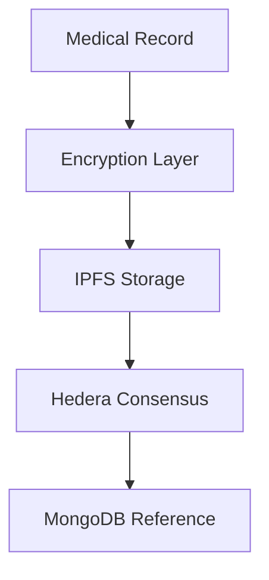

# 🏥 Hedera Healthcare Records & Badge System


A secure, decentralized healthcare records management system built on Hedera Hashgraph with an integrated NFT-based achievement system. The platform ensures HIPAA-compliant storage and sharing of medical records while incentivizing medical education through verifiable NFT badges.

## 🌟 Key Features

### Healthcare Records Management 

- **End-to-End Encryption**: AES-256-GCM encryption for all sensitive medical data
- **Decentralized Storage**: IPFS integration for distributed content storage
- **Blockchain Verification**: Hedera Consensus Service (HCS) for immutable audit trails
- **HIPAA Compliance**: Secure data handling with patient consent management

### NFT Badge System

- **Verifiable Credentials**: NFT-based certification for achievements
- **Token Standards**: Custom HTS (Hedera Token Service) implementation
- **Achievement Tracking**: Course completion and certification verification

## 🔐 Security Architecture

### Data Protection


### Security Features
- AES-256-GCM encryption for PHI (Protected Health Information)
- Cryptographic patient identification
- Zero-knowledge storage architecture
- Immutable audit trails via HCS
- Secure key management system

## 🛠️ Technical Stack

- **Blockchain**: Hedera Hashgraph
  - Consensus Service (HCS)
  - Token Service (HTS)
  
- **Backend**:
  - Node.js & Express
  - MongoDB Atlas
  - IPFS via Pinata
  
- **Security**:
  - AES-256-GCM encryption
  - ED25519 key pairs

## 📖 API Documentation

### Health Records API

```typescript
POST /api/health-records/submit
{
  "patientId": "patient@email.com",
  "content": {
    "diagnosis": "...",
    "treatment": "...",
    "medications": [...]
  },
  "metadata": {
    "provider": "Dr. Smith",
    "facility": "General Hospital"
  }
}
```

### Badge System API

```typescript
POST /api/badges/mint
{
  "userEmail": "medical.professional@hospital.com",
  "courseId": "course_mongodb_id",
  "metadata": {
    "name": "Advanced Cardiac Care",
    "description": "Completed advanced cardiac care certification"
  }
}
```

## 🔧 Installation & Setup

```bash
# Clone repository
git clone https://github.com/yourusername/hedera-healthcare
cd hedera-healthcare

# Install dependencies
npm install

# Configure environment
cp .env.example .env
# Edit .env with your credentials

# Start server
npm run dev
```
